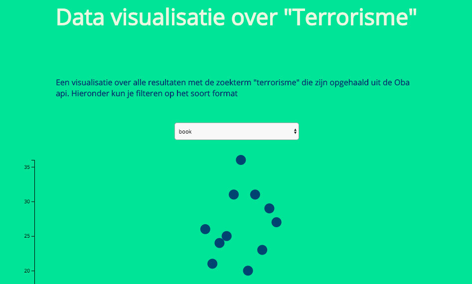

# Front-end Data

Een D3 Datavisualisatie over de correlatie tussen terroristische aanslagen door de jaren heen en het aantal publicaties films/boeken over dit onderwerp.



## index

1.  [Inleiding](#inleiding)
2.  [Proces](#proces)
3.  [Product](#product)
4.  [Installatie](#installatie)
5.  [Tooling](#tooling)
6.  [Code](#code)
7.  [Todo](#todo)
8.  [Reflectie](#reflectie)

## Inleiding

Voor het vak Front-end data heb ik een datavisualisatie gemaakt over de zoekterm 'terrorisme'. Mijn hypothese is dat na de aanslagen van 11/09/2001 op de twin towers in Amerika, het aantal publicaties over dit onderwerp aanzienlijk is toegenomen. Met name omdat de term "terrorisme" vanaf toen vaker werd rondgegooid onder het publiek. Voor die tijd waren er namelijk ook genoeg terroristische aanvallen, alleen werden deze wereldwijd minder een hot topic.

In mijn visualisatie wilde ik een onderscheid maken tussen het aantal formats. Alle formats die ik meenam in mijn zoektocht waren: boeken, dvdvideo's, daisy roms en audioboeken. Daarnaast heb ik ook een onderscheid gemaakt in genre. Dit leek mij interessant om te zien wat de trend is in de verschillende formats.

## Proces

Eerst heb ik alle data opgehaald uit de Oba-api. Met behulp van de _Gissa scraper_ (met dank aan Gijs Laarman), verliep het vrij gemakkelijk om data op te halen uit meerdere pages. Daarbij heb ik wel een filter moeten schrijven die alle de resulaten ophaalde zoals ik deze graag in mijn JSOn bestand wilde. Het viel mij op dat er nog veel velden die ik nodig had, op NULL stonden. Daarvoor heb ik een filter geschreven die alle resultaten die NULL bevatte, niet werden meegenomen in mijn JSON bestand.

Vervolgens ben ik aan de slag gegaan met mijn D3 visualisatie. Het inladen van het JSON bestand zelf in mijn D3 script ging uiteraard vrij gemakkelijk. Om de data weer vervolgens op een fijne manier uit nest functie te krijgen vond ik vrij lastig. Ik zag niet meer hoe ik nou een bepaalde key of value op kon vragen. Uiteindelijk met hulp van Gijs Laarman is dit wel gelukt.

##Product

Het product zelf is [hier](https://techdemo.github.io/frontend-data/) te vinden. Het is gehost op github pages en maakt gebruik van een statisch JSON bestand. Tot nu toe heb ik een filter aangebracht op het soort Format. Het is ook de bedoeling dat hier uiteindelijk nog een tweede filter bij komt waarmee je kan filter op het soort genre. Het lijkt mij interessant om te zien hoe de verhoudingen zijn tussen verschillende genres en de hoeveelheid jaren ten opzichte van het twin towers incident.

Mijn eerste insteek was om een barchart te maken. Echter tijdens het maken van de visualisatie liep ik tegen zoveel heuvels op dat een scatterplot toch meer te realiseren was binnen de tijd. De scatterplot vind ik zelf nog steeds een geschikte manier om deze data te tonen, anders had ik dit uiteraard niet doorgezet.

Wat ik interessant vond om te zien was dat er vrij weinig audioboeken/daisyroms zijn in de Oba met de search-term "terrorisme".

## Installatie

````
​```
# clone the repository
https://github.com/Techdemo/frontend-data.git

# change directory
cd frontend-data

# create a .env file
touch env

#add public and secret to env file

# install dependencies
npm install

# install browser-sync
npm install browser-sync

# start browser sync or open the html file in your browser.
npm start
​```
````

## Tooling

- #### Browser-sync

  Browser-sync geeft een live preview van het html bestand waar de D3 visualisatie op werd getoont. Browser-sync kijkt naar je folder voor veranderingen in je html, js en css bestanden.

- #### ESlint

  Eslint is een javascript die je helpt om patronen en fouten te herkennen in je JS bestanden. Eerst dacht ik dat deze linter een soort 'algemene-herken-de-fouten-in-mijn-js' tool was. Maar na het lezen van de docs kwam ik erachter ESlint meer een tool is om je te helpen een bepaalde code stijl aan te houden. Justus heeft een college gegeven over clean code. Aan de hand daarvan ben ik gaan inlezen over hoe je als een team van developers een code stijl kan afspreken en deze stijl kan verwerken in je ESlint. Airbnb heeft dit ook gedaan en hun config file staat online. Deze heb ik geinstalleerd in mijn linter. Tussendoor zette ik eens mijn linter aan om te kijken wat er beter kon aan mijn code stijl.

- #### D3

  D3 is a JavaScript bibliotheek om DOM te manipuleren om data te visualiseren in een svg.

- #### Gissa oba scraper

  Gijs Laarman heeft een te gekke scraper geschreven voor de Oba-api, die het mij mogelijk maakte om meerdere pagina's uit de api op te halen. De scraper werkt met promises; hij haalt pas de volgende pagina op wanneer de vorige pagina klaar is met ophalen.

## Code

Zoals ik al eerder beschreef heb ik de scraper van Gijs Laarman gebruikt om data uit de api te halen. Met de volgende filter functie heb ik data gefilterd op variabelen die ik wilde hebben. Daarnaast heb ik alle resultaten gefilterd op NULL. Alle results die een NULL bevatten in de variabelen die ik wilde, zijn er zo uitgefilterd. Uiteindelijk word alles naar een JSOn geschreven.

```client.getPages(search).then(res => {
  let data = res.data;
  const newArray = data.filter(d => {
    return d.genre && d.format !== null ? d : false;
  });

  return fs.writeFile("dataset.json", JSON.stringify(newArray), "utf8", () => {
    console.log("file written");
  });
});
```

Om de cirkels aan te passen wanneer je een nieuwe value selecteert in het menu, wordt er een `Onchange` functie aangeroepen. In deze functie wordt gekeken naar het specifieke format die als value uit de formfield komt. Daarna wordt er gefilterd op alles wat niet overeenkomt met het format. De `function format` geeft een `formatCount` terug voor de hoeveelheid per format.

```function onChange() {
      let field = this.value;

      const byFormat = booksByYear
        .map(year => ({
          ...year,
          values: year.values.filter(book => book.key == field)
        }))
        .filter(year => year.values.length > 0);
```

## Todo

- [ ] een form maken voor het filteren op genre
- [ ] aan de algehele styling wat doen. Zo wil ik bijvoorbeeld de assen stijlen
- [ ] De scatterplot kunnen koppelen aan een andere api die mij verteld wanneer belangrijke terroristische aanslagen hebben plaatsgevonden. Zo krijg je nog meer context over waar de cijfers vandaan kunnen komen. Het verteld meer een verhaal.
- [ ] Mocht er voor dit bovenstaande geen geschikte API zijn dan kun je hier misschien zelf iets voor schrijven.

## Reflectie

Mensen die mij hebben geholpen :

- Gijs Laarman
- Folkert-jan van der Pol
- Guus Dijkhuis
- Daniel van der Schuur
